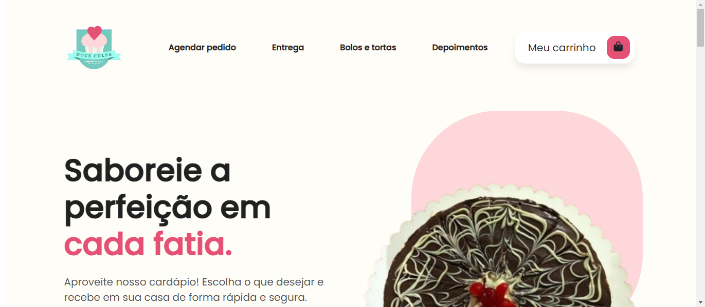
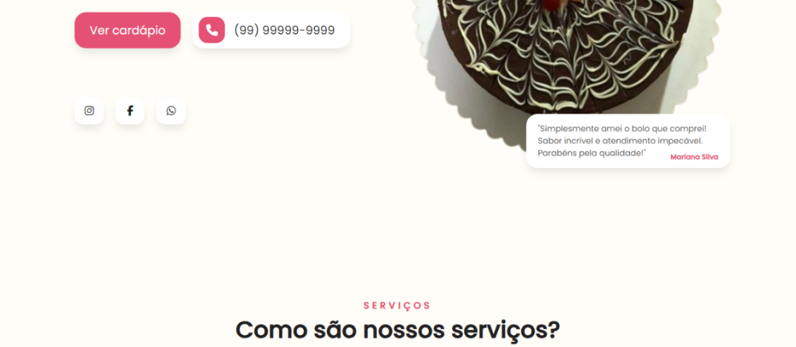
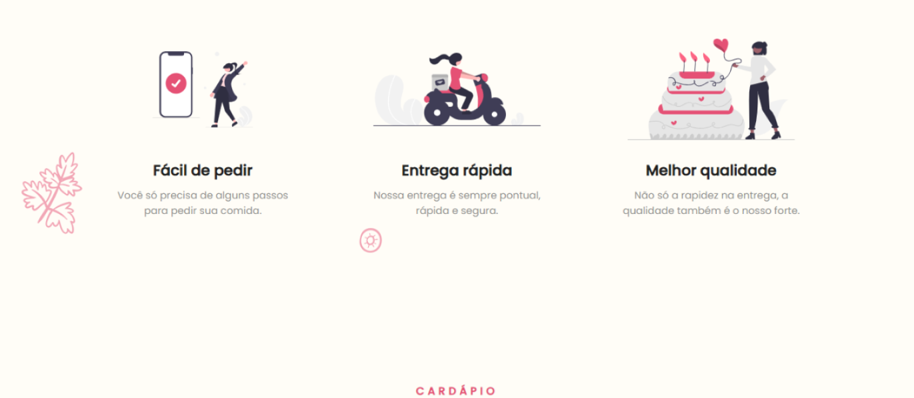
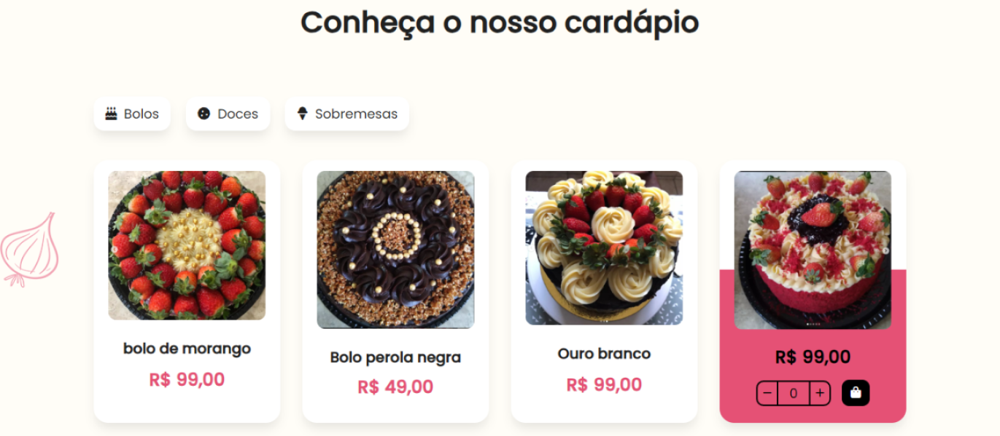
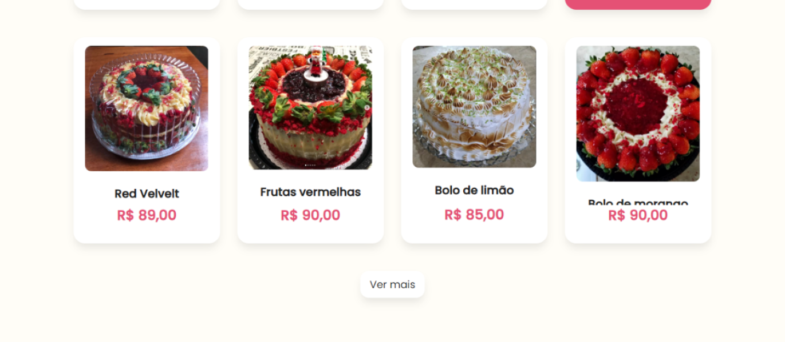
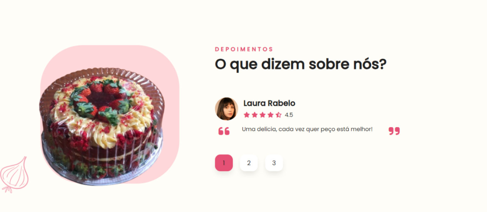
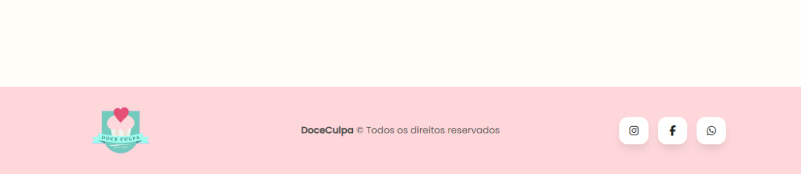

# Delivery system via WhatsApp

Project created for **Doce Culpa** - a cakes and pies website with a personalized system via WhatsApp!

## Overview

**Doce Culpa** is a website developed that allows users to place personalized orders for cakes, pies and sweets, and be directed to the company's WhatsApp with a list of chosen orders.

## Project photos

    - result of the Vercel project: https://doce-culpa-website-and-delivery-system.vercel.app/

## Tools used:
    - Html
    - CSS
    - JavaScript

## How it works

1. ### features
    - choose quantity of products
    - add products to cart
    - add delivery address (post code, neighborhood, number)
    - send the chosen products to the company's WhatsApp
    - delivery fee

## Contact ✉️

- Email: mattheusp382@gmail.com
- LinkedIn: [Mattheus-Pereira](https://www.linkedin.com/in/mattheuspereira/)
- Portfolio: [mtp-dev.com](https://mtpdev.com.br/)

## Contribution 🤝

If you want to contribute to a project or encounter a problem, feel free to open a new issue or send a pull request. Any contribution is welcome!

## License ⚖️

This portfolio is licensed under the [MIT License](https://opensource.org/licenses/MIT).