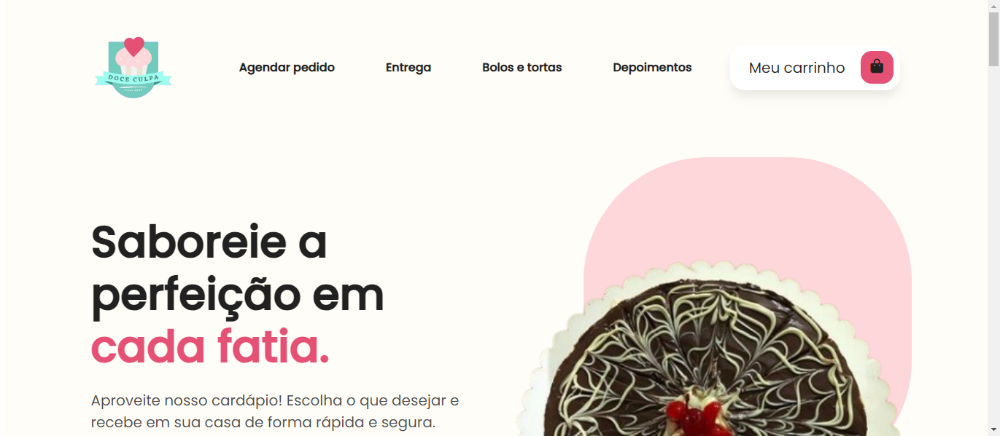
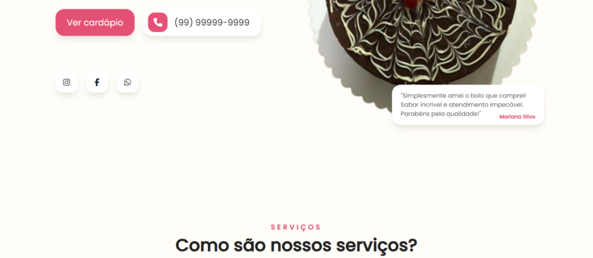
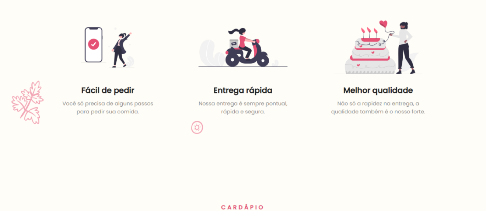
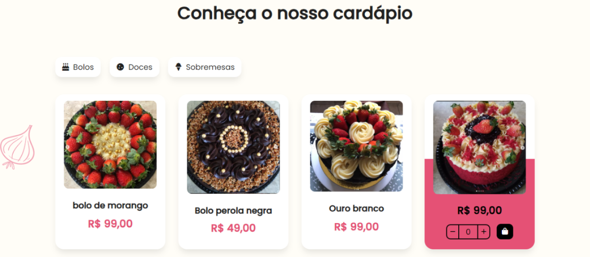
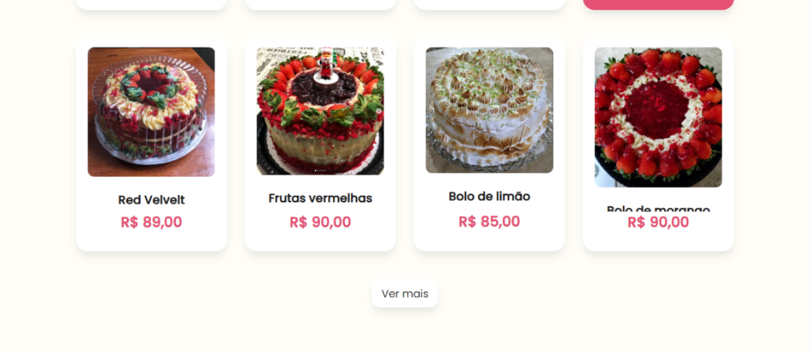
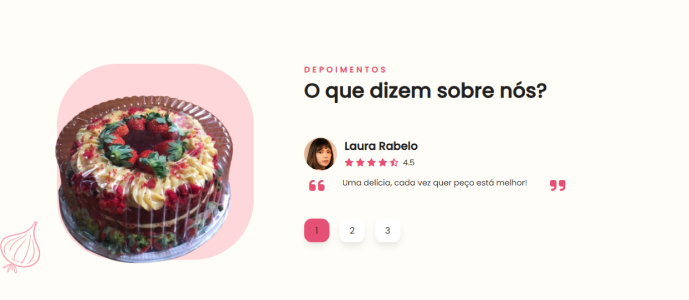
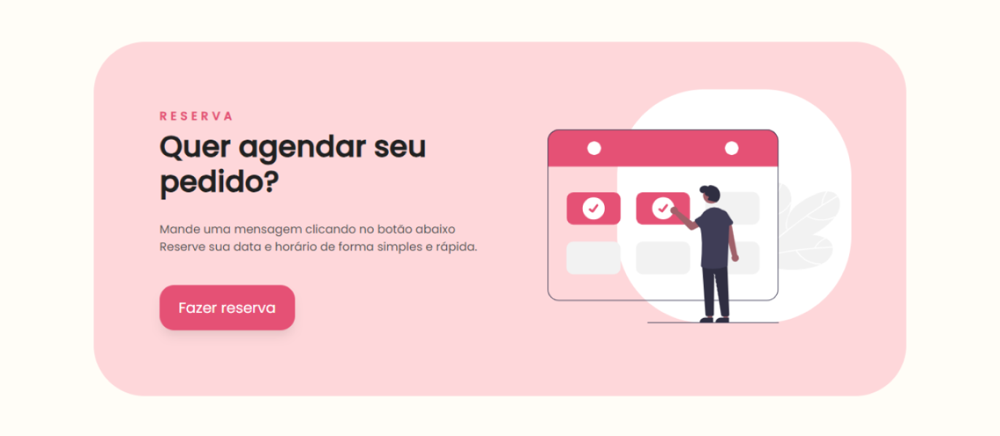
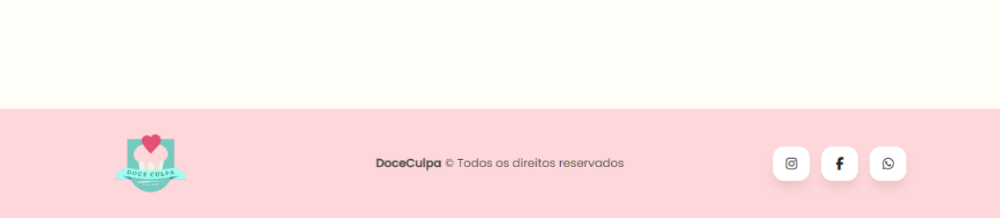

# Sistema de Delivery via WhatsApp

Projeto criado para **Doce Culpa** - um site bolos e tortas com sistema personalizado via WhatsApp!

## Vis√£o Geral

A **Doce Culpa** é um site desenvolvido que permite aos usuários fazerem pedidos personalizados de bolos, tortas e doces, e serem direcionados para o WhatsApp da empresa com uma lista de pedidos escolhidos.

## Fotos do projeto

   - resultado do projeto Vercel: https://doce-culpa-website-and-delivery-system.vercel.app/

## Ferramentas utilizadas: 
   - Html
   - Css
   - JavaScript

## Como Funciona

1. ### funcionalidades
   - escolher quantidade de produtos
   - adicionar produtos ao carrinho
   - adicionar endereço de entrega (codigo posta, bairro, numero)
   - enviar os produtos escolhidos para o whatsapp da empresa
   - taxa de entrega

## Contato ✉️

- E-mail: mattheusp382@gmail.com
- LinkedIn: [Mattheus-Pereira](https://www.linkedin.com/in/mattheuspereira/)
- Portfólio: [mtp-dev.com](https://mtpdev.com.br/)

## Contribuição 🤝

Se você deseja contribuir com algum projeto ou encontrar algum problema, fique à vontade para abrir uma nova issue ou enviar um pull request. Toda contribuição é bem-vinda!

## Licença ⚖️

Este portfolio é licenciado sob a [Licença MIT](https://opensource.org/licenses/MIT).
